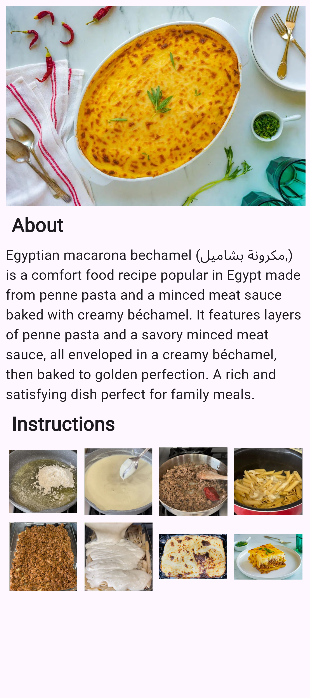

# Recipe Screen  💫  
=======
# Screen1
CIS Task . Screen about fav food .
=======
# screen1_cis

## Overview  
A clean and simple **Egyptian Macarona Bechamel** recipe screen featuring:  
- A delicious dish image 🍽️  
- A brief description 📖  
- Step-by-step cooking visuals 📷  

## UI Preview  
  

## How to Use  
1. Read the **About** section.  
2. Follow the **Instructions** images.  

Quick, easy, and elegant! ✨

